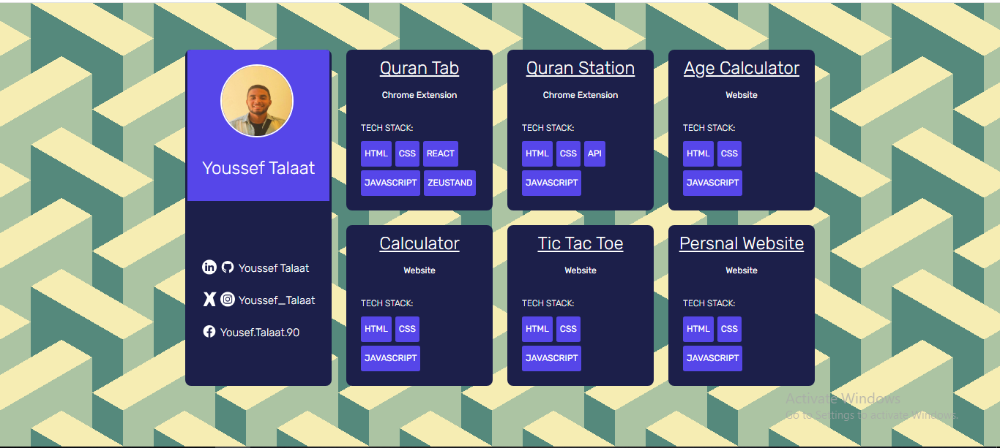

<h1 align="center">🖼️ Portfolio Grid</h1>

A clean and responsive <strong>HTML</strong> & <strong>CSS</strong> portfolio page displaying projects in a modern card layout. Includes tech stack tags and clickable social links, designed for both personal branding and showcasing work.

<h2>📸 Preview</h2>

  

<h2>📱 Mobile-Friendly</h2>
<ul>
  <li>✅ Fully responsive design for mobile, tablet, and desktop</li>
  <li>✅ Modern grid-based project display</li>
  <li>✅ Includes profile section with social links</li>
</ul>

<h2>🛠️ Tech Stack</h2>
<ul>
  <li>🧱 HTML5 (semantic markup)</li>
  <li>🎨 CSS3 (custom properties, grid layout)</li>
  <li>⚡ Responsive design with CSS Grid & Flexbox</li>
</ul>

<h2>🚀 Live Demo</h2>

🌐 View here: <a href="https://yousseftalaat-collab.github.io/Portfolio-Grid/" target="_blank">Live Project</a>

📂 GitHub Repo: <a href="https://github.com/Yousseftalaat-collab/Portfolio-Grid" target="_blank">Repository</a>

<h2>🧠 What I Practiced</h2>
<ul>
  <li>Designing clean, professional portfolio layouts</li>
  <li>Using CSS Grid for responsive multi-column layouts</li>
  <li>Styling reusable tech stack badges</li>
</ul>

<h2>🧪 How to Run</h2>
<ol>
  <li>📥 Clone or download the repository</li>
  <li>📂 Open <code>index.html</code> in your browser</li>
  <li>✅ Done! No extra setup needed</li>
</ol>

<h2>💬 Contact</h2>

📧 Email: <a href="mailto:yousseftalaat142@gmail.com">yousseftalaat142@gmail.com</a>

🔗 LinkedIn: <a href="https://www.linkedin.com/in/youssef-talaat-1aa2671b3/">Youssef Talaat</a>

🐱 GitHub: <a href="https://github.com/Yousseftalaat-collab">Yousseftalaat-collab</a>

---

<h3 align="center">✨ Created & Maintained by <strong>Youssef Talaat</strong></h3>
